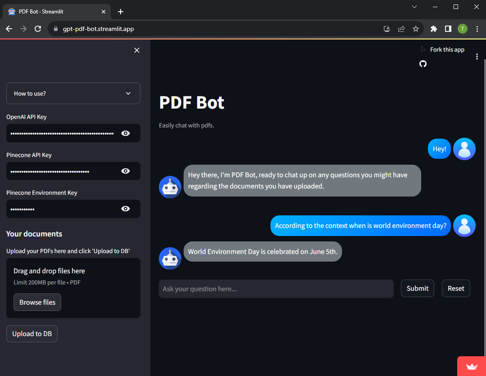

<h1 align="center">
  <br>
  PDF Bot: Your Intelligent PDF Assistant
</h1>

<p align="center"> 
  <a href="https://www.python.org/">
    
  </a>
  <a href="https://python.langchain.com/docs/get_started/introduction.html">
    
  </a>
  <a href="https://openai.com/">
    
  </a>
  <a href="https://streamlit.io/">
    
  </a>
  <a href="https://docs.pinecone.io/docs/overview/">
    
  </a>
</p>

<p align="center">
  <a href="#overview">Overview</a>
  •
  <a href="#installation">Installation</a>
  •
  <a href="#instructions-to-use">Instructions to Use</a>
  •
  <a href="#contribution">Contribution</a>
</p>

# Overview
PDF Bot is an advanced AI-powered bot designed to assist you with questions and queries related to PDF documents. Leveraging the power of OpenAI's GPT model, PDF Bot offers a seamless experience for users seeking information and insights from their PDF files. Whether you have a single file or multiple documents, PDF Bot is here to help.

# Installation
- Clone this branch: `git clone --single-branch --branch pinecone https://github.com/ibizabroker/gpt-pdf-bot.git`
- Create a virtual environment
```
$ pip install virtualenv
$ virtualenv venv
$ .\venv\Scripts\activate
```
- Once your virtual environment is activated, install the required pacakges: `pip install -r requirements.txt`
- Run the streamlit app in an activated virtual environment: `streamlit run bot.py`

# Instructions to Use
- Enter your openai and [pincone](https://www.pinecone.io/) keys in the text input.
- In pinecone create an index named `storage`, select `cosine` and give the dimensions as `1536`.
- You can either drag and drop or browse files to upload pdfs, after the pdfs have been uploaded press on `Upload to DB` for it to get embedded.
- Start chatting with the bot :)



# Contribution
Feel free to open an issue or submit a pull request. Your feedback and suggestions are greatly appreciated :)

This project is licensed under the MIT License - see the [LICENSE](LICENSE) file for details.